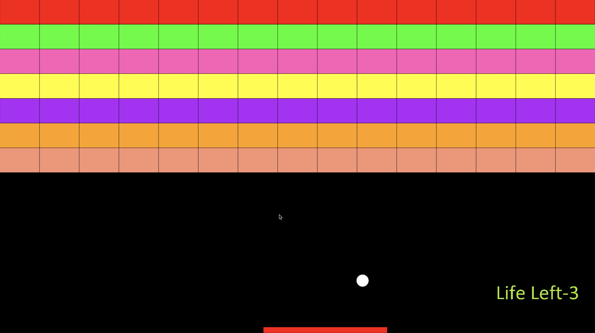

# BrickBreaker-Atari-Breakout-

This project is my implementation of the game Atari Breakout in processing.

## Gameplay

The Game Uses Sound which requires the Minim Library. 
The Game keeps track of the Score and the player has 3 lives.
